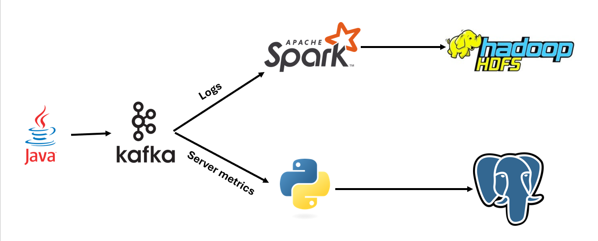

# Server Metrics & Logs Monitoring System

## Project Overview

A distributed monitoring system for tracking server metrics and load balancer logs across a cloud storage infrastructure:

- **Infrastructure**: 10 application servers + 1 load balancer
- **Data Collection**: Java-based agents simulate metric and log generation
- **Data Pipeline**:
  - Kafka cluster (3 nodes) with two dedicated topics:
    - one for resource consumption data from application servers
    - and another to access logs from the load balancer
  - PostgreSQL database for metrics storage
  - HDFS for log archiving



## System Components

1. **Data Producers**:
   - Java application simulating server agents
   - Generates both metrics and log data

2. **Data Processing**:
   - Python consumer for metrics
   - Spark application for logs

3. **Storage**:
   - PostgreSQL (resource consumption metrics)
   - HDFS (log archiving)

## Prerequisites

- Docker and Docker Compose
- Java JDK 11+
- Maven
- Python 3.8+
- Spark 3.0+

## Installation & Setup

### 1. Infrastructure Setup

Start all required services:
```bash
docker-compose -f docker-compose.kafka.yml \
               -f docker-compose.postgres.yml \
               -f docker-compose.hdfs.yml up -d
```

### 2. Kafka Topics Configuration

Create topics with the specified configurations:

1. Access a Kafka broker:
```bash
docker exec -it kafka1 bash
```

2. Create topics:
```bash
kafka-topics --bootstrap-server localhost:9092 \
             --create \
             --topic test-topic3 \
             --partitions 2 \
             --replication-factor 3 \
             --config retention.ms=86400000

kafka-topics --bootstrap-server localhost:9092 \
             --create \
             --topic test-topic4 \
             --partitions 3 \
             --replication-factor 3 \
             --config retention.ms=86400000
```

> **Note**: Complete topic configurations are available in `Brokers & Topics Configuration.pdf`

## Running the System

### 1. Start Data Producers

Navigate to `the Java application` directory and execute:
```bash
cd java_program
mvn clean compile exec:java
```

### 2. Launch Metrics Consumer (Python/PostgreSQL)

Run the Python consumer:
```bash
cd metrics_consumer
python main.py
```

**Verification**: Access PGAdmin at `http://localhost:5050` to inspect the `system_metric` table in the `metrics` database.

### 3. Deploy Logs Consumer (Spark/HDFS)

Build and run the Spark application:
```bash
cd logs_consumer
docker build -t spark_app .
docker run --name=spark_container --network=kafka-spark-net spark_app
```

**Verification**: Access the HDFS NameNode at `http://localhost:9870` and navigate to `/user/spark/log_stats` to verify parquet file generation.

## Monitoring Interfaces

- **PostgreSQL**: `http://localhost:5050` (PGAdmin)
  - Credentials: admin@example.com / admin
- **HDFS**: `http://localhost:9870`